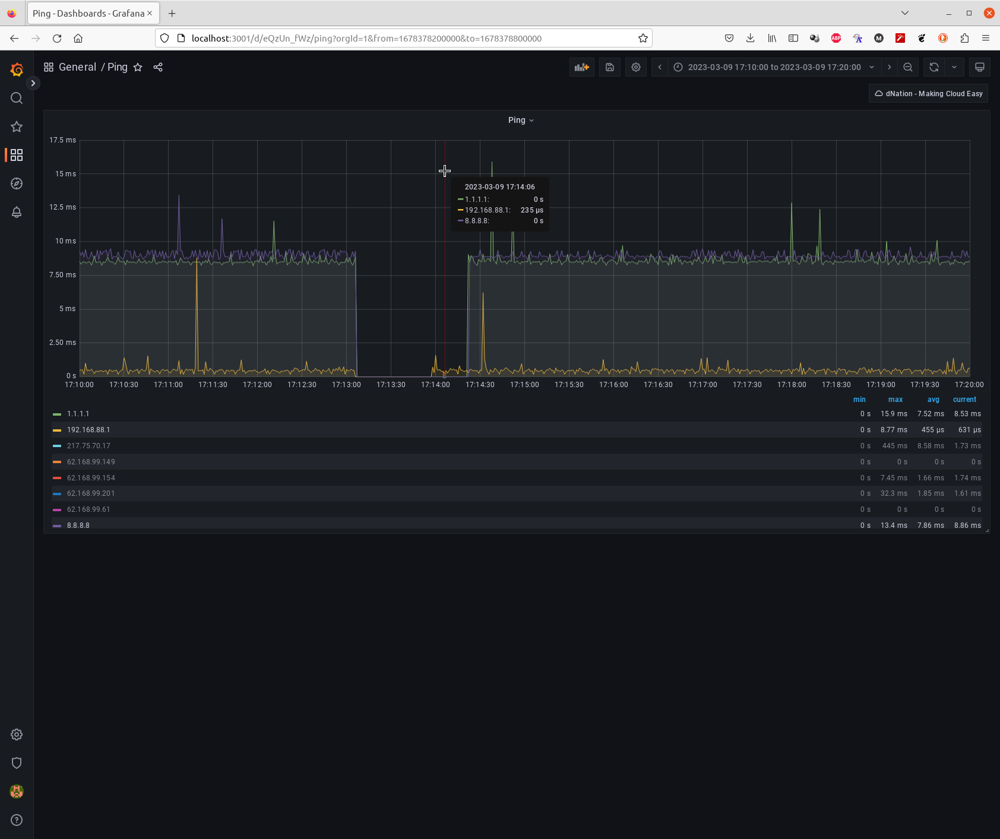

# dNation Internet Outage Detector

Ever wondered why your video calls sometimes suffer from poor voice/video quality? It may be related to reliability (not bandwidth) of your Internet connection.

We had this problem in my company for a while, main difficulty was that it happened only rarely. This project helps to detect Internet outages over a long period of time (e.g. 1 month) with minimal footprint. 

It uses [iperf3](https://github.com/esnet/iperf) running in special mode using minimal bandwidth so your other activities are not affected by the test. 

It helped us to detect defective Wi-Fi router and find out reliability of our Internet provider (99.98%).

# Running Test

## Server Side
```
# Connect to a server with iperf3 package installed
# This might be e.g. remote VM if you intend to test external connectivity
# or a machine in your local network if you want to test just your Wi-Fi router
ssh iperf3-server-1

# Optional: As we are going to run long lasting test, we probably want to use screen
screen

# Run iperf3 in server mode on port 6050, print statistics every 60 seconds (instead of every second; note we are not using these, just reducing printouts)
iperf3 -s -p 6050 -i 60

# Detach screen window so you can logout while iperf3 is still running
CTRL+a d

# Connect to 2nd iperf3 server running in different provider, so we can classify outages (see below)
ssh iperf3-server-2
screen
iperf3 -s -p 6050 -i 60
CTRL+a d

```

## Client Side
```
# Run test for 1 week
#
# Note 86400 secs (1 day) is the max enforced by iperf3 itself
# Use n > 1 for tests lasting more than 1 day
#
# Connect to iperf3-server-1
./iperf3.sh iperf3-server-1 6050 86400 7 `hostname`.iperf3-server-1.`date +%Y-%m-%d-%H.%M.%S`.log
#           server        port secs  n log, e.g. hp.2022-12-23-17.41.16.log

# Connect to iperf3-server-2
./iperf3.sh iperf3-server-2 6050 86400 7 `hostname`.iperf3-server-2.`date +%Y-%m-%d-%H.%M.%S`.log
```

# Evaluating Test

Parse log files produced in previous step:
```
./iperf3.py hp.iperf3-server-1.2022-12-22-16.18.48.log hp.iperf3-server-1.2022-12-22-16.18.48.log
hp.iperf3-server-1.2022-12-22-16.18.48.log: duration 1 day 1:21:30, 0 outages
hp.iperf3-server-2.2022-12-22-16.18.48.log: duration 1 day 1:21:30, 0 outages
```
## No Outages
Example above shows no outages, so no further action is needed - your Internet connection was reliable during whole test.

## Classifying Outages
Another example below shows several outages:
```
./iperf3.py hp-eth.h1.2023-02-26-21.08.56.log hp-eth.cz-1.2023-02-13-08.49.22.log 
hp-eth.h1.2023-02-26-21.08.56.log: duration 10 days 20:05:21, longest outage 113 secs, total 2 outages lasting 189 secs (0.02019%)
hp-eth.cz-1.2023-02-13-08.49.22.log: duration 24 days 8:24:51, longest outage 226 secs, total 5 outages lasting 532 secs (0.02529%)
```

Use `-v` switch for printing detailed info including timestamps when outages happened, longest one marked with `*` character:
```
./iperf3.py -v hp-eth.h1.2023-02-26-21.08.56.log hp-eth.cz-1.2023-02-13-08.49.22.log 
hp-eth.h1.2023-02-26-21.08.56.log: duration 10 days 20:05:21, longest outage 113 secs, total 2 outages lasting 189 secs (0.02019%)
  * 2023-03-07 17:49:23 UTC, duration 0:01:53 (74424.00-74537.00)
    2023-03-09 17:13:05 UTC, duration 0:01:16 (72245.00-72321.00)
hp-eth.cz-1.2023-02-13-08.49.22.log: duration 24 days 8:24:51, longest outage 226 secs, total 5 outages lasting 532 secs (0.02529%)
  * 2023-02-21 21:59:18 UTC, duration 0:03:46 (47393.00-47619.00)
    2023-02-21 22:06:30 UTC, duration 0:00:27 (47825.00-47852.00)
    2023-02-21 22:06:58 UTC, duration 0:03:19 (47853.00-48052.00)
    2023-03-08 09:47:23 UTC, duration 0:00:04 (3473.00-3477.00)
    2023-03-09 17:13:06 UTC, duration 0:01:16 (30215.00-30291.00)
```

There are 7 outages listed above. An outage might have multiple root causes, e.g.:
1. Connection problems of your Internet provider to outside world where your iperf3 server is running
2. Remote iperf3 server machine connection problems which are outside of control of your Internet provider

Outage at `2023-03-09 17:13:05` was detected for both `h1` and `cz-1` iperf3 servers, so there is a fair chance it is the case 1) above.

When reporting an outage to your Internet, it might be useful to state which IP address (node) was causing trouble. To do so, you can run test simultaneously with [dNation Ping](https://dnation.cloud/products/ping/). In our example we did so, so we can closely examine relevant outage time period:

1) Go to http://localhost:3001/

2) Use following credentials to login:  
User: `admin`  
Password: `tmp`

3) Display graph around `2023-03-09 17:13:05` timestamp (all timestamps are UTC):  
`# TODO: Check that UTC timezone is really used in both Internet Outage Detector and Ping`


Indeed, we can see that at:
* 17:13:06 We haven't received a response from any servers being pinged, including Wi-Fi router itself (192.168.88.1) which is managed by our Internet provider
* 17:13:58 Wi-Fi router started to reply
* 17:14:22 IPs 1.1.1.1 and 8.8.8.8 started to reply, external connectivity was restored

This particular outage looks like short power supply interruption causing Wi-Fi router reboot.

Note there is still an option that machine we are using for measurements completely lost connection e.g. because of faulty network card driver, but that would by recorded in `/var/log/syslog`.

If you are going to use dNation Ping, following command will help you to identify targets worth of being pinged:
```
mtr --report -c 1 -n 1.1.1.1
Start: 2023-03-10T17:15:35+0100
HOST: EliteBook-8530p             Loss%   Snt   Last   Avg  Best  Wrst StDev
  1.|-- 192.168.88.1               0.0%     1    0.3   0.3   0.3   0.3   0.0
  2.|-- 84.245.97.1                0.0%     1    0.5   0.5   0.5   0.5   0.0
  3.|-- 217.75.70.17               0.0%     1    1.5   1.5   1.5   1.5   0.0
  4.|-- 62.168.99.149              0.0%     1    3.9   3.9   3.9   3.9   0.0
  5.|-- 62.168.99.154              0.0%     1    1.6   1.6   1.6   1.6   0.0
  6.|-- 91.210.16.171              0.0%     1    7.8   7.8   7.8   7.8   0.0
  7.|-- 1.1.1.1                    0.0%     1    8.5   8.5   8.5   8.5   0.0
```

## Additional Test Scenarios

Following use cases were considered:

1. Testing external connectivity: see description above
1. Testing local network elements, e.g. two Wi-Fi routers located in different rooms  
* Test is ran on both Wi-Fi routers each connecting to the same local iperf3 server but different port (e.g. 6050 and 6051)
* Real outages are those when one test reports outage while the other doesn't, so Wi-Fi router reporting an outage is defective

# Open Tasks
1. When evaluating two log files at the same time, detect overlaps only, so it doesn't have to be done visually
1. `./iperf3.py --group hp-eth.h1.*.log --group hp-eth.h1.*.log`
1. Support MatterMost notifications
1. `docker-compose build` - so image for MikroTik can be easily created
1. Support stdin to reduce HDD footprint - no need for big (> 100 MB) temporary *.log file which may not fit on MikroTik
